# 🐧 Linux Production Server Lab

<p align="center">


</p>

---

# 📖 Project Overview

The **Linux Production Server Lab** is a practical project created to simulate the daily activities of a Linux System Administrator, Junior Cloud Engineer and Junior DevOps Engineer.

Instead of only learning Linux commands, the goal of this project was to build and validate a production-like Linux environment using real administration tasks.

During this project I practiced Linux commands, troubleshooting, networking, process management, permissions, Bash scripting, automation with Cron, log analysis and production validation.

The project is organized into **11 phases**, each one focused on a different area of Linux administration.

---

# 🎯 Project Goals

- Build a structured Linux project
- Practice real Linux administration tasks
- Learn troubleshooting techniques
- Create reusable Bash scripts
- Simulate production server validation
- Improve documentation skills
- Build a professional GitHub portfolio project

---

# 📂 Repository Structure

```text
linux-production-server-lab/

├── README.md
├── LICENSE
│
├── docs/
│   ├── phase1-notes.md
│   ├── phase2-notes.md
│   ├── ...
│   ├── phase11-notes.md
│   └── production-validation-report.md
│
├── project-files/
│   ├── app/
│   ├── database/
│   ├── monitoring/
│   ├── nginx/
│   └── reports/
│
├── screenshots/
│
└── .gitignore
```

---

# 📚 Project Phases

| Phase | Description |
|--------|-------------|
| Phase 1 | Project Initialization |
| Phase 2 | Filesystem Setup |
| Phase 3 | File Management |
| Phase 4 | Linux Permissions |
| Phase 5 | Processes & Services |
| Phase 6 | Linux Networking |
| Phase 7 | Bash Scripting |
| Phase 8 | Log Analysis |
| Phase 9 | Task Scheduling (Cron) |
| Phase 10 | System Monitoring |
| Phase 11 | Production Server Validation |

---

# 💻 Linux Commands Practiced

During this project I practiced more than 70 Linux commands.

## 📁 Filesystem

```bash
pwd
ls
ls -l
mkdir
touch
cp
mv
rm
rmdir
find
tree
```

## 📄 File Management

```bash
cat
less
head
tail
nl
grep
wc
echo
```

## 🔐 Permissions

```bash
chmod
chown
groups
id
whoami
```

## ⚙️ Processes

```bash
ps
ps -ef
top
kill
kill -9
jobs
fg
bg
```

## 🛠 Services

```bash
systemctl status
systemctl start
systemctl stop
systemctl restart
systemctl enable
systemctl is-active
```

## 📜 Logs

```bash
journalctl
journalctl -f
journalctl -u
journalctl -n
journalctl -p err
```

## 🌐 Networking

```bash
ip addr
ip route
hostname
ping
ssh
scp
ss -tuln
curl
wget
nslookup
```

## 💾 Disk Management

```bash
df -h
du -sh
sort
tar
```

## 🤖 Bash

```bash
#!/bin/bash
chmod +x
./script.sh
echo
date
hostname
uptime
free
```

## ⏰ Automation

```bash
crontab -e
crontab -l
```

---

# 🤖 Bash Scripts Created

During this project I created several Bash scripts to automate common Linux administration tasks.

| Script | Purpose |
|---------|---------|
| backup.sh | Backup files and directories |
| deploy.sh | Simulate application deployment |
| health-check.sh | Basic system health verification |
| system-report.sh | Generate a Linux system report |

The scripts were executed manually and also automated using Cron jobs.

---

# 📸 Project Screenshots

The project includes more than **100 screenshots** documenting every stage of the project.

Below are some of the most representative screenshots.

---

## 🚀 First Git Commit and Push

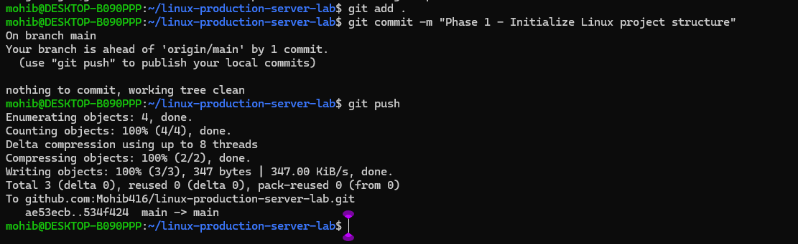

---

## 📁 Final Linux Project Structure

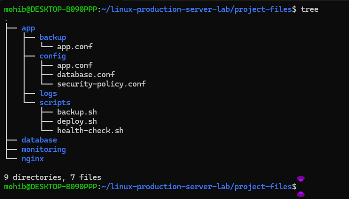

---

## 🔐 Linux Permissions and Ownership

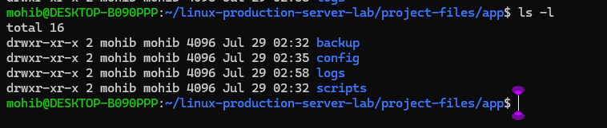

---

## ⚙️ Processes and Services

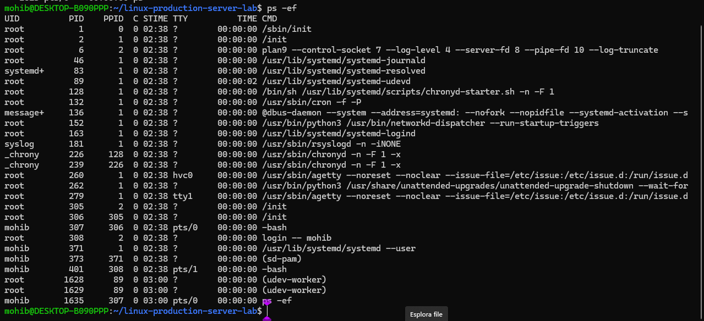
---

## 🌐 Listening TCP/UDP Ports

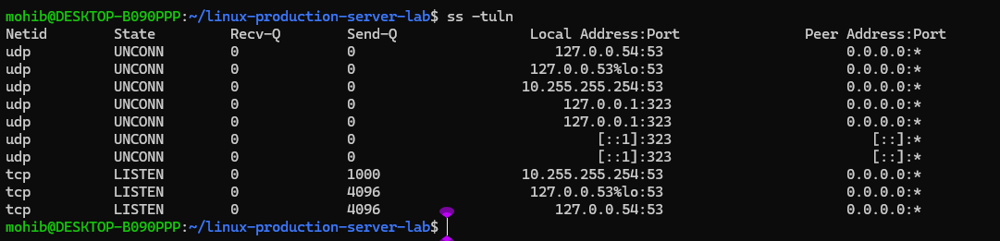

---

## 🤖 Bash System Report Script

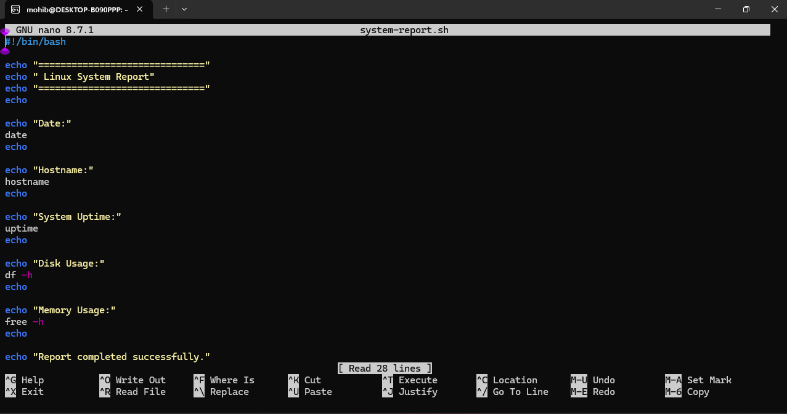

---

## 📜 Log Analysis and Troubleshooting

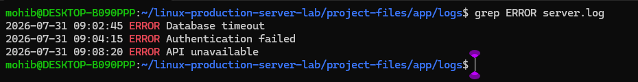

---

## ⏰ Cron Job Automation

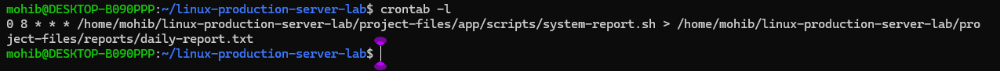

---

## 📊 System Monitoring

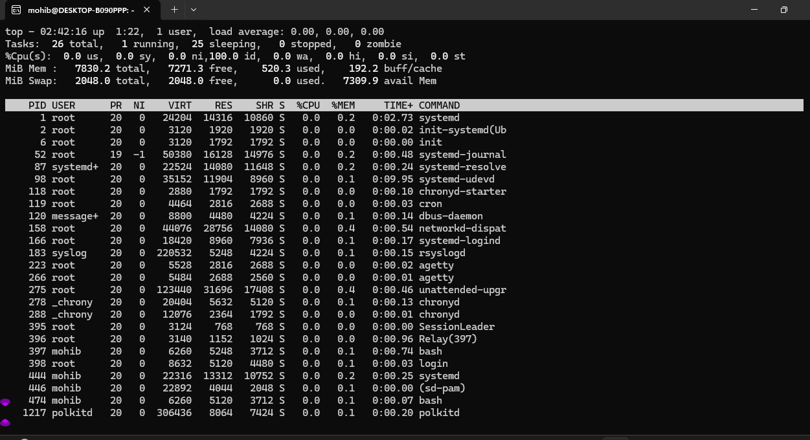

---

## ✅ Final System Validation Report

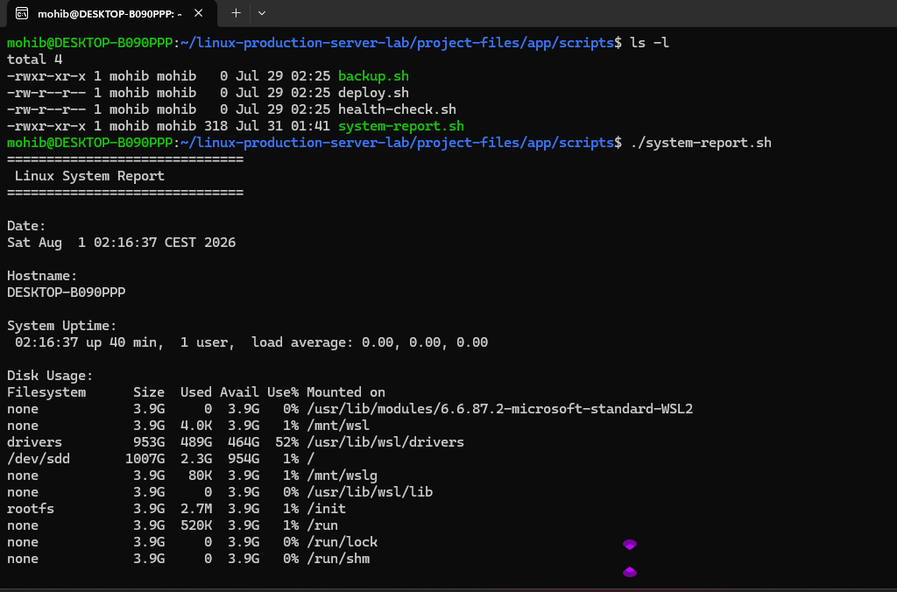

---

## 🎉 Final Git Push

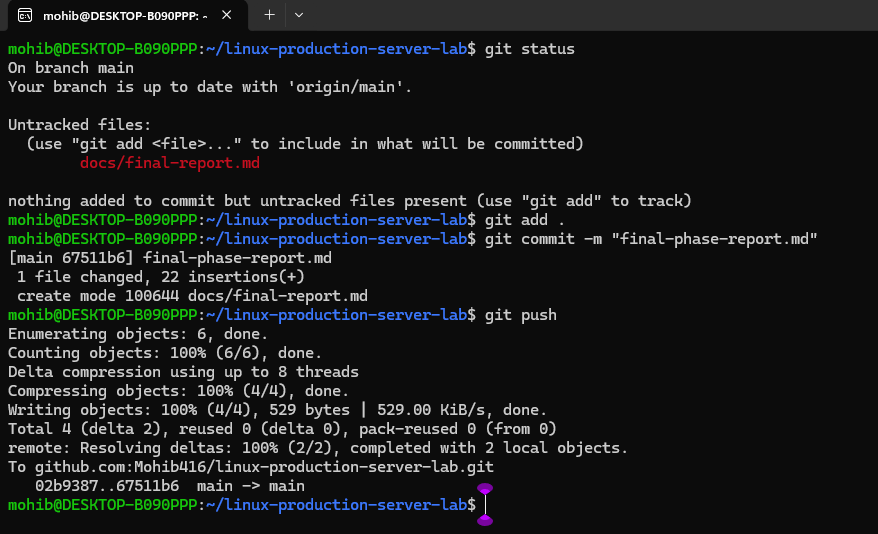

---

> **Note:**  
> The complete project contains more than **100 screenshots** documenting the entire Linux Administration Lab.  
> Only the most representative screenshots are included here to keep the repository clean and easy to navigate.


---

# 📊 Project Results

After completing this project I can confidently perform common Linux administration tasks such as:

- Managing files and directories
- Working with Linux permissions
- Monitoring processes
- Managing Linux services
- Reading and analyzing logs
- Troubleshooting common problems
- Managing disk usage
- Using SSH for remote administration
- Writing basic Bash scripts
- Automating tasks with Cron
- Using Git and GitHub professionally

---

# 📈 Skills Developed

Throughout this project I strengthened my practical knowledge in:

-Linux Administration
-Bash Scripting
-Troubleshooting
-Networking
-Git & GitHub
-SSH
-Cron
-System Monitoring

---

# 👨‍💻 About Me

I am passionate about Cloud Computing, Linux and Cybersecurity.

I enjoy learning by building practical projects that simulate real working environments.

My current goal is to start my career as a:

- Junior Cloud Engineer
- Junior DevOps Engineer
- Junior Linux System Administrator

I believe that practical experience, continuous learning and good documentation are essential for professional growth.

---

# 📬 Contact

If you would like to connect or discuss this project, feel free to reach out.

- GitHub: **(add your GitHub profile)**
- LinkedIn: **(add your LinkedIn profile)**

